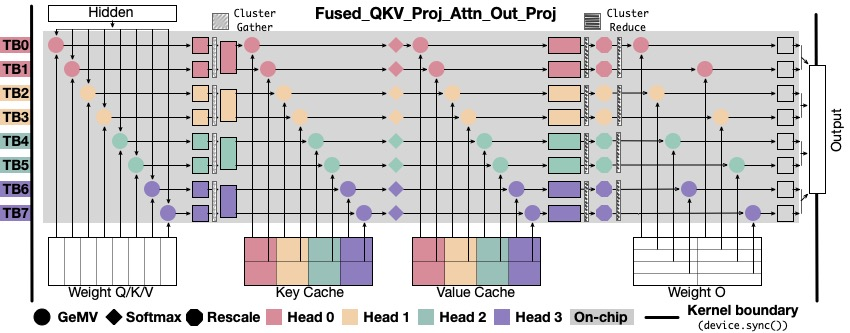

# ClusterFusion: Expanding Operator Fusion Scope for LLM Inference via Cluster-Level Collective Primitive
[[Paper](https://arxiv.org/abs/2508.18850)]



## News

## Installation

### Requirements
- CUDA 12.4  
- PyTorch 2.5.1  
- Python 3.12

1. Clone this repository and navigate to ClusterFusion folder
```
git clone https://github.com/xinhao-luo/ClusterFusion.git
cd clusterfusion
```

2. Install Package
```
pip install -e .
```

## Usage

We provide following script to run ClusterFusion.
```
USE_CLUSTER_FUSION=true torchrun --nproc_per_node 1 tests/text_completion_llama.py \
	--ckpt_dir /PATH/TO/llama2-7b \
	--tokenizer_path /PATH/TO/llama2-7b-tokenizer \
	--max_seq_len 1024 --max_batch_size 1 \
	--max_gen_len 1024
```

