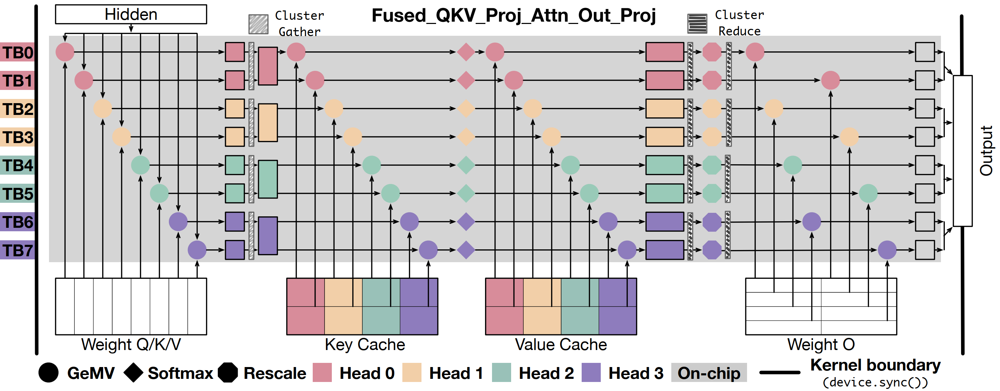
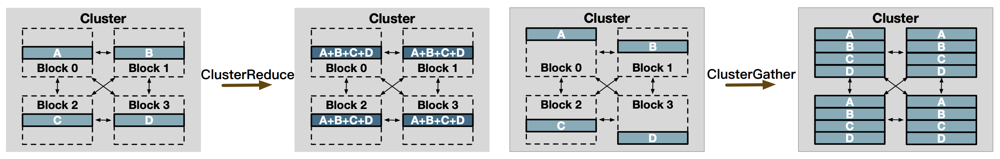

# ClusterFusion: Expanding Operator Fusion Scope for LLM Inference via Cluster-Level Collective Primitive
[[Paper](https://arxiv.org/abs/2508.18850)]



* ClusterFusion with Llama-2-7B on H100 GPU:


## News
- [2025/09] 🔥 ClusterFusion has been accepted to **NeurIPS 2025**!

## Installation

#### Requirements
- CUDA 12.4  
- PyTorch 2.5.1  

1. Clone this repository and navigate to ClusterFusion folder:
```
git clone https://github.com/xinhao-luo/ClusterFusion.git
cd clusterfusion
```

1. Install ClusterFusion kernels:
```
pip install -e .
```

## Usage

We provide following script to run ClusterFusion.
```
USE_CLUSTER_FUSION=true torchrun --nproc_per_node 1 chat/chat.py \
	--ckpt_dir /PATH/TO/llama2-7b \
	--tokenizer_path /PATH/TO/llama2-7b-tokenizer \
	--max_seq_len 1024 --max_batch_size 1 \
	--max_gen_len 1024
```
## Examples

#### E2E

```python
from clusterfusion import lama_decoder_layer

llama_decoder_layer(
	output,
	residual_output,
	hidden_states,
	residual,
	qkv_weight,
	o_weight,
	paged_kv_indptr_buf,
	paged_kv_indices_buf,
	k_data_ptrs,
	v_data_ptrs,
	layer_id,
	rms_weight,
	eps,
	positions,
	cos_sin
)

```

#### Primitives

```cuda
cluster_reduce<CLUSTER_SIZE, Stage::LINEAR>(
        size, tid, HEAD_DIM, cluster_block_id,  
        src_addr, dst_addr, bar_ptr, 
        neighbor_dst_bar, local_qkv, weight);
```

